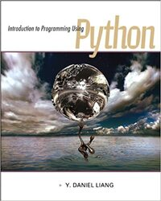

# Liang - Introduction to Python 

Solutions to Introduction to Programming Using Python by Y. Daniel Liang, 1st edition

 

# Contents

    
    <ol>
        <li>Introduction to Computers, Programs, and Python</li>
        <li>Elementary Programming</li>
        <li>Mathematical Functions, Strings, and Objects</li>
        <li>Selections</li>
        <li>Loops</li>
        <li>Functions</li>
        <li>Objects and Classes</li>
        <li>More on Strings and Special Methods</li>
        <li>GUI Programming Using Tkinter</li>
        <li>Lists</li>
        <li>Multidimensional Lists</li>
        <li>Inheritance and Polymorphism</li>
        <li>Files and Exception Handling</li>
        <li>Tuples, Sets, and Dictionaries</li>
        <li>Recursion</li>
    </ol>

